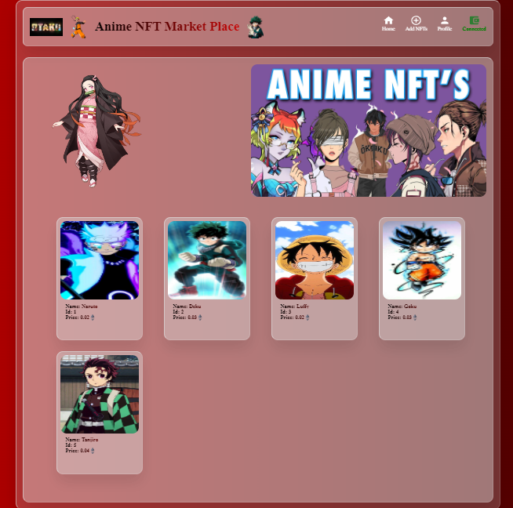
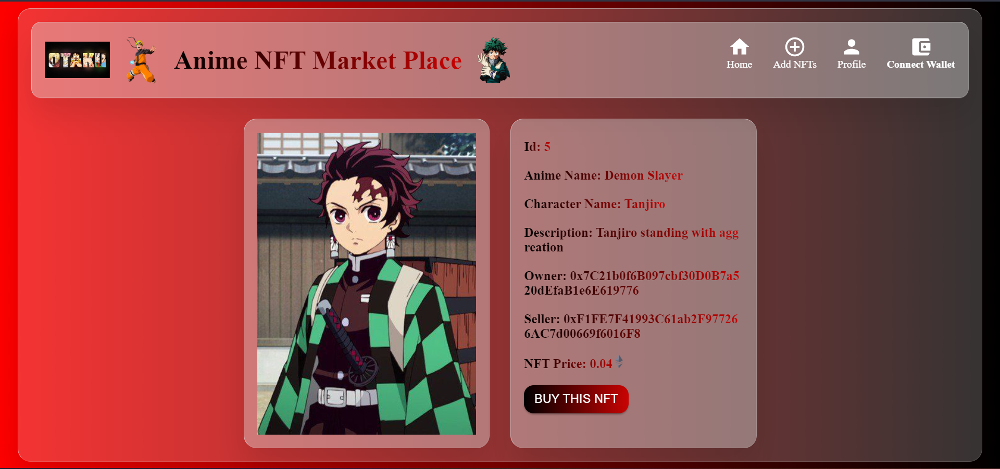
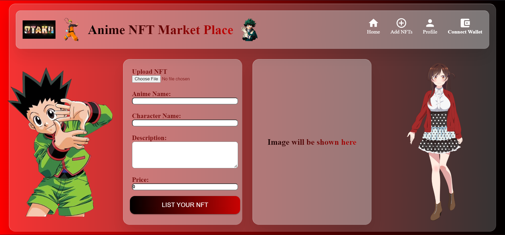

<!-- About This project -->

# 🚀Anime NFT Marketplace
This is an Anime NFT market place. Here you can see all Anime NFTs. You can buy those NFTs, Also you can list your own Anime character's as a NFT in to the marketplace.

  

## Build with🚀
* [Solidity](https://docs.soliditylang.org/)
* [Hardhat](https://hardhat.org/getting-started/)
* [React.js](https://reactjs.org/)
* [ethers.js](https://docs.ethers.io/v5/)
* [Pinata](https://www.pinata.cloud/)

<!-- User Manual -->

## User Manual

### Home Page

  

When you enter this site, you can see some default NFTs (Demo NFT). First you have to connect your wallet by clicking connect wallet button. Then after refreshing you can see some NFTs showed up into home page. This NFTs are besically all previous users. You can see details of that NFT by clicking each of the NFT card.

### NFT Title page:

  

Here you can see the details about that perticuler NFT. This consists of Id, Anime Name, Character Name, Description, Owner, Seller & NFT Price.

### Create NFT page:

Here you can create your own NFTs. You can choose your NFT Anime image and you have give the Anime Name, Character Name, Description and Price of your NFT and then click List Your NFT to upload your NFTs into blockchain. Remember that for each NFT listed, you have to give a listing price 0.01 eth.

  

After createing an NFT soon a alert pop up, and redirect to home page. If you refresh the page, you can see your NFT.

### Profile page:

  

In Profile page, you can see the NFTs you have owned, as well as here you can see the number of total NFTs that you have owned and the total price of those NFTs.

### Buy NFT:

In NFT title page you can see each of the NFTs in details. In this page you can see the Buy NFT button in those NFTs which you have not owned. You can buy those NFTs by clicking Buy NFT button, you have to pay the exact price that are given in those NFTs.
